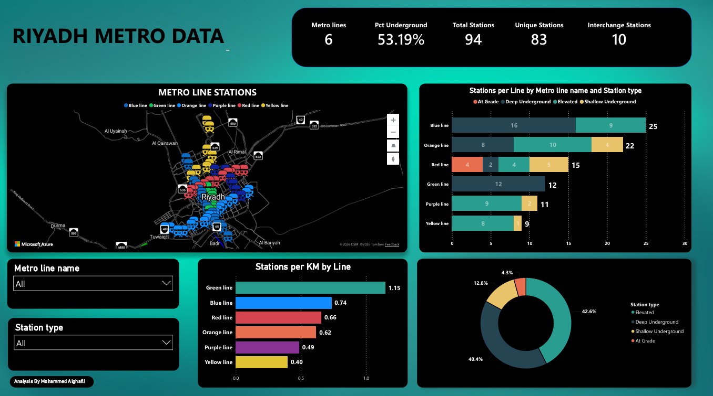

# Riyadh Metro Power BI Dashboard

An interactive Power BI dashboard analyzing Riyadh Metro stations, lines, and operational insights.

## Project Overview

This project focuses on analyzing Riyadh Metro data through an interactive Power BI dashboard.  
The dashboard includes KPI cards, station-level analysis, line filters, and visual storytelling.

## Tools Used

- Power BI
- Power Query
- DAX
- Excel

## Key Features

- Interactive dashboard layout
- KPI cards
- Line and station filters
- Station-level visual analysis
- Data cleaning and transformation using Power Query
- DAX measures for dashboard metrics

## Dashboard Preview

## Files

- `dashboard.pbix` — Power BI dashboard file
- `dashboard-preview.png` — Dashboard screenshot

## What I Learned

- Cleaning and transforming data using Power Query
- Building KPI cards and interactive visuals
- Using DAX measures
- Designing dashboards for clear business insights
